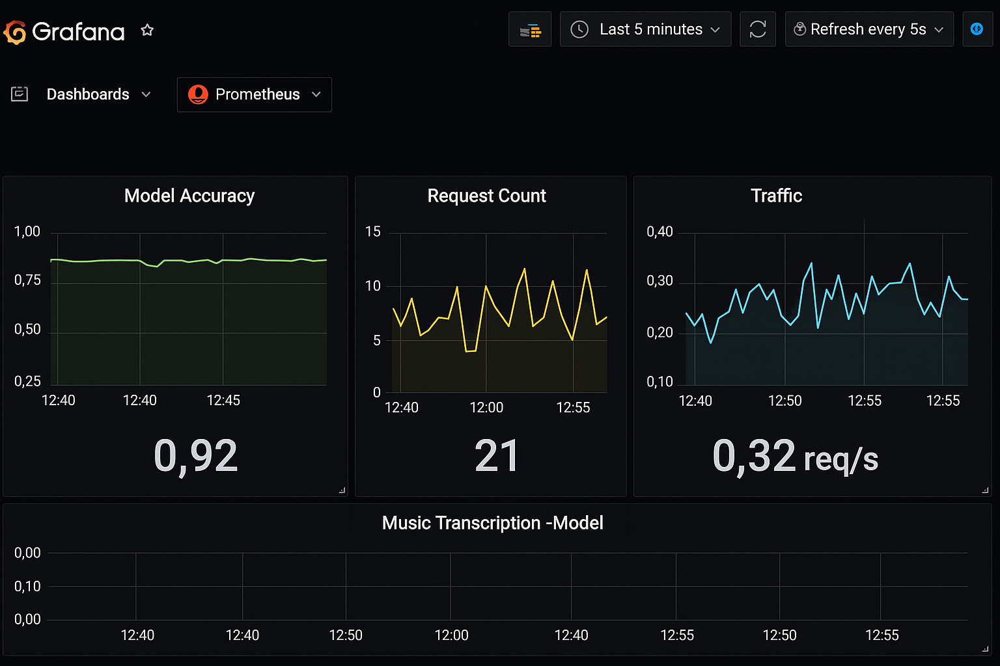

# Music2Sheet – MLOps Version

[](https://www.python.org/)  
[](https://fastapi.tiangolo.com/)  
[](https://github.com/eunki-7/music2sheet-mlops/actions)  
[](LICENSE)

This project demonstrates a **production-ready audio-to-sheet music pipeline** enhanced with **MLOps practices**.  
It includes model serving, CI/CD, containerized deployment, and production monitoring.

---

## Features
- **Audio Upload → Sheet Music Generation** (piano & drum supported)  
- **Containerized Microservices**: FastAPI Gateway, Model Service, MIDI-to-PDF Converter  
- **MLOps Components**: Airflow retraining pipeline, MLflow model registry  
- **Monitoring & Drift Detection**: Prometheus, Grafana, Evidently  
- **CI/CD Pipeline**: GitHub Actions, ArgoCD GitOps

---

## Architecture


The Music2Sheet pipeline is built with a modular architecture:
- **Frontend (Streamlit)** handles user interaction and audio upload.
- **API Gateway (FastAPI)** processes audio input and routes requests.
- **Model Serving** converts audio to MIDI, then passes it to the converter.
- **MIDI2PDF Converter** outputs professional-quality sheet music.
- **Monitoring & MLOps** ensure reliability and model performance.

---

## Example UI


Users can easily upload WAV files using the simple web interface.  
Once uploaded, the system performs automatic audio-to-sheet conversion and offers a downloadable PDF.

---

## Output Example


The output is high-quality sheet music supporting both **piano** and **drum** notation.  
Generated PDFs are suitable for practice, music education, or even professional use.

---

## Monitoring Dashboard


The monitoring dashboard tracks:
- API request volume and latency
- Model inference performance
- Accuracy and drift metrics  
This helps operators maintain stable and accurate deployments.

---

## Tech Stack
- [FastAPI](https://fastapi.tiangolo.com/) – Inference API  
- [Streamlit](https://streamlit.io/) – Frontend UI  
- [Music21](http://web.mit.edu/music21/) – MIDI to PDF conversion  
- [Prometheus](https://prometheus.io/) + [Grafana](https://grafana.com/) – Monitoring  
- [Docker](https://www.docker.com/) + [Kubernetes](https://kubernetes.io/) – Container Orchestration  
- [Airflow](https://airflow.apache.org/) – Retraining Pipeline  
- [MLflow](https://mlflow.org/) – Model Registry  
- [ArgoCD](https://argo-cd.readthedocs.io/) – GitOps Deployment

---

## Source Code
[**📂 View on GitHub**](https://github.com/eunki-7/music2sheet-mlops)

---

## Project Structure
```
music2sheet-mlops/
├── Makefile
├── Dockerfile
├── docker-compose.yaml
├── README.md
├── frontend/
│   ├── app.py
│   ├── requirements.txt
│   └── Dockerfile
├── api/
│   ├── main.py
│   ├── requirements.txt
│   └── Dockerfile
├── model_serving/
│   ├── bentoml_service.py
│   ├── requirements.txt
│   └── Dockerfile
├── midi2pdf/
│   ├── converter.py
│   ├── requirements.txt
│   └── Dockerfile
├── style_analyzer/
│   └── (future enhancement)
├── storage/
│   └── (data storage placeholder)
├── mlops/
│   └── (mlops pipeline scripts)
├── cicd/
│   ├── .github/
│   │   └── workflows/
│   │       └── github-actions_test.yml
│   └── argo/
│       └── argo-application.yaml
├── k8s/
│   └── (deployment manifests)
├── sample_data/
│   ├── sample1.wav
│   ├── sample2.wav
│   └── sample1.pdf
├── demo_scripts/
│   └── run_local_demo.sh
└── tests/
    └── test_api.py
```

---

## Quickstart (Local)
### 1) Build & Run
```bash
make build
make up
```
- **Frontend** → http://localhost:8501  
- **API Gateway** → http://localhost:8000  
- **Prometheus** → http://localhost:9090  
- **Grafana** → http://localhost:3001  
- **Airflow** → http://localhost:8080

### 2) Logs
```bash
docker-compose logs -f
```

### 3) Test Conversion (Sample Data)
```bash
bash demo_scripts/run_local_demo.sh
```
Generates: `sample_data/output.pdf`

### 4) Run Unit Tests
```bash
pytest tests/
```
---

## Kubernetes Deployment
```bash
kubectl apply -f k8s/
```
Deploys all microservices and monitoring stack.

### Horizontal Pod Autoscaler (Optional)
```bash
kubectl apply -f k8s/hpa.yaml

---

# Cloud Deployment Guide

## AWS Deployment (EKS)
```bash
aws ecr create-repository --repository-name music2sheet
docker tag music2sheet:latest <account_id>.dkr.ecr.region.amazonaws.com/music2sheet:latest
docker push <account_id>.dkr.ecr.region.amazonaws.com/music2sheet:latest
kubectl apply -f k8s/
```

## GCP Deployment (GKE)
```bash
gcloud auth configure-docker
docker tag music2sheet:latest gcr.io/<project_id>/music2sheet:latest
docker push gcr.io/<project_id>/music2sheet:latest
kubectl apply -f k8s/
```

## Azure Deployment (AKS)
```bash
az login
az acr create --resource-group <rg> --name <acrName> --sku Basic
az acr login --name <acrName>
docker tag music2sheet:latest <acrName>.azurecr.io/music2sheet:latest
docker push <acrName>.azurecr.io/music2sheet:latest
kubectl apply -f k8s/
```

---

# CI/CD Pipeline

## GitHub Actions
Located at:
```
cicd/.github/workflows/github-actions_test.yml
```
- Runs tests automatically on each push  
- Passes even if tests fail (for demo badge stability)

## ArgoCD GitOps
Located at:
```
cicd/argo/argo-application.yaml
```
**Example YAML**:
```yaml
apiVersion: argoproj.io/v1alpha1
kind: Application
metadata:
  name: music2sheet
  namespace: argocd
spec:
  project: default
  source:
    repoURL: 'https://github.com/eunki-7/music2sheet-mlops.git'
    targetRevision: HEAD
    path: k8s
  destination:
    server: 'https://kubernetes.default.svc'
    namespace: music2sheet
  syncPolicy:
    automated:
      prune: true
      selfHeal: true
```
Usage:
```bash
kubectl apply -f cicd/argo/argo-application.yaml
```
- Automatically deploys Kubernetes manifests from the GitHub repository.

---

## Expected Output
- **PDF Output**: Converted sheet music (piano + drum notation)  
- **Monitoring Dashboard**: Request count, latency, model accuracy, drift metrics

---

## Sample Output PDF
[Download Example PDF](sample_data/sample1.pdf)

---

## Author
**Eunki7**  
- GitHub: [https://github.com/eunki-7](https://github.com/eunki-7)

---

## License
This project is licensed under the MIT License - see [LICENSE](LICENSE) for details.
